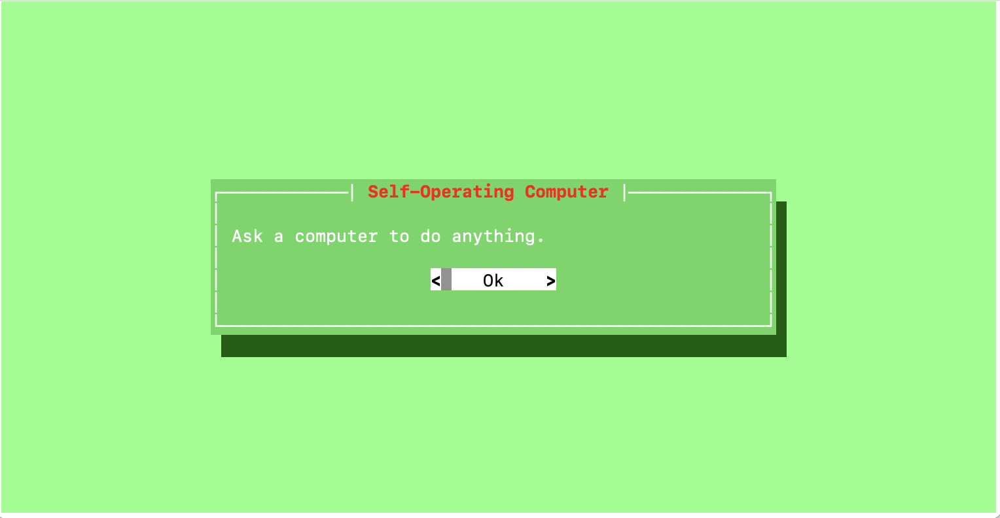

# Self-Operating Computer



An experimental framework that enables multimodal AI models to operate a computer, performing tasks autonomously by interpreting screen content and controlling the mouse and keyboard.

## Overview

The Self-Operating Computer is a framework that allows AI models to interact with a computer just like a human would - by looking at the screen and using the mouse and keyboard. This enables AI to perform a wide range of tasks across different applications without requiring specific API integrations.

### Key Features

- **Visual Understanding**: Uses multimodal AI models to interpret what's on the screen
- **Computer Control**: Automates mouse movements, clicks, and keyboard inputs
- **Voice Input Support**: Optional voice command functionality
- **Cross-Platform**: Works on macOS, with ongoing improvements for Linux and Windows compatibility
- **Multiple Model Support**: Compatible with various AI models including GPT-4 with OCR

## Installation

### Prerequisites

- Python 3.8 or higher
- pip (Python package installer)

### Setup

1. Clone the repository:
   ```bash
   git clone https://github.com/OthersideAI/self-operating-computer.git
   cd self-operating-computer
   ```

2. Install the required dependencies:
   ```bash
   pip install -r requirements.txt
   ```

3. For voice input functionality (optional):
   ```bash
   pip install -r requirements-audio.txt
   ```

## Usage

### Basic Operation

Run the self-operating computer with the default model:

```bash
operate
```

Or specify a model:

```bash
operate -m gpt-4-with-ocr
```

### Command Line Options

- `-m, --model`: Specify the AI model to use (default: gpt-4-with-ocr)
- `--voice`: Enable voice input mode
- `--verbose`: Run in verbose mode for detailed output
- `--prompt`: Directly input an objective prompt

### Example

```bash
# Run with voice input
operate --voice

# Run with a specific prompt
operate --prompt "Open a web browser and search for the weather forecast"
```

## How It Works

The Self-Operating Computer operates through a simple loop:

1. **Capture Screen**: Takes a screenshot of the current display
2. **Analyze Content**: Sends the screenshot to an AI model along with the user's objective
3. **Determine Action**: The AI decides what action to take (click, type, press keys)
4. **Execute Action**: The system performs the chosen action
5. **Repeat**: This process continues until the objective is completed

The AI model uses a percentage-based grid system to determine click locations, making it adaptable to different screen resolutions.

## License

This project is licensed under the terms of the LICENSE file included in the repository.

## Acknowledgements

This project builds upon research and development in multimodal AI, computer vision, and human-computer interaction. It represents an experimental approach to enabling AI systems to interact with computers in a more human-like manner.
